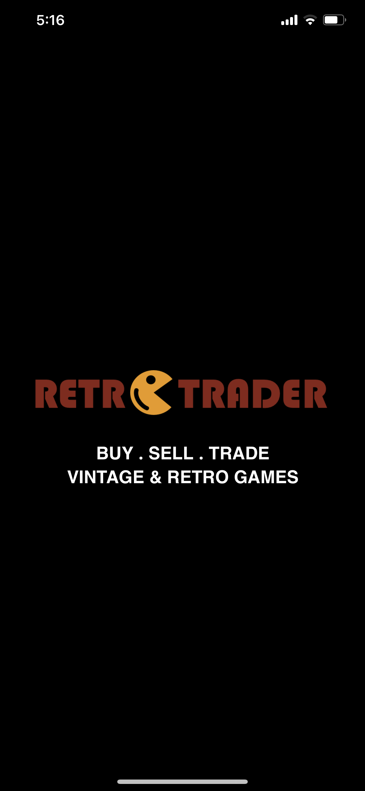
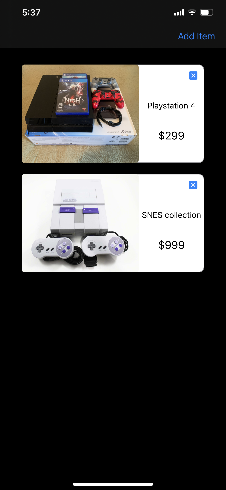
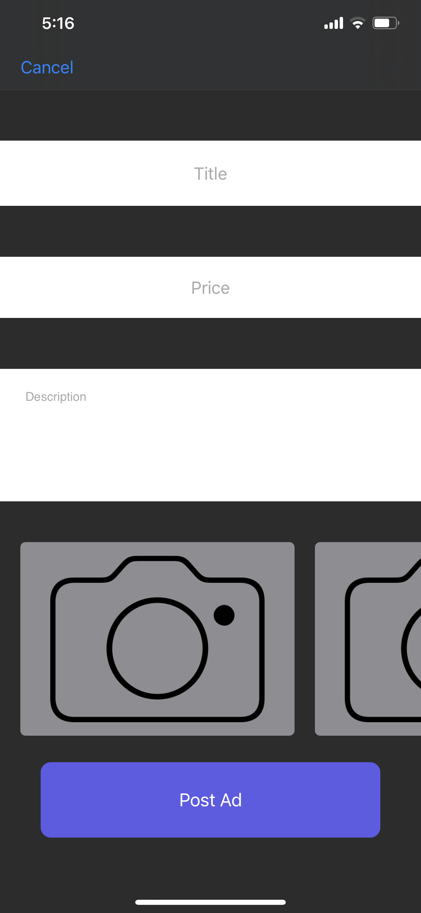
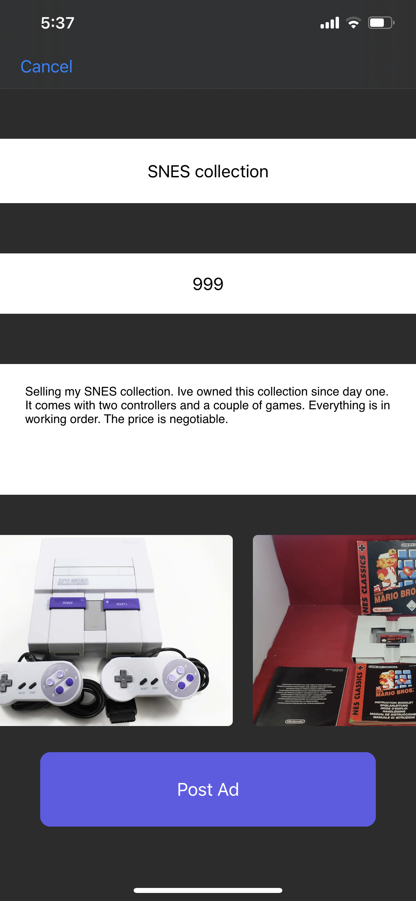
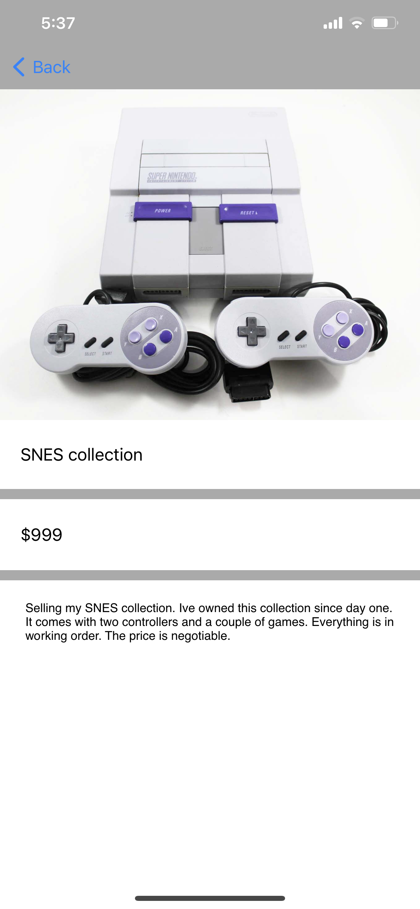

<a href="https://www.garynazdev.com/">

> A marketplace for buying, selling, and trading your retro and vintage video game products.

## Table of contents
* [General info](#general-info)
* [Screenshots](#screenshots)
* [Technologies](#technologies)
* [Requirements](#requirements)
* [Setup](#setup)
* [Features](#features)
* [To Do](#To-do-list)
* [Inspiration](#inspiration)
* [Contact](#contact)

## General info
The purpose of this project is to build an application for video game enthusiasts and hobbiests, where they can 
buy, sell, and trade their retro and vintage video game products in an open market.

## Screenshots
    

## Technologies
* Swift 5
  
## Requirements
* iOS 13+
* Xcode 12+

## Setup
* Clone and setup the project.
* Open in Xcode: open RetroTrader.xcodeproj

## Features
* Post ads for video game products.
* Add up to 6 images to each ad, and present the ad in a UICollectionView.

## To-do list
* Add locations to ad's in order to allow users to search by location.
* Add Buy, Sell, or Trade, buttons for users to select when posting a new ad.
* Add Category heading, and search by category (Video Games, Consoles, Other) functionality for the user.

## Inspiration
As a gamer, I would often take advantage of marketplace apps where I could buy, sell, or trade my video games 
with other hobbiests, and this is what inspired me to build this app. I wanted to build an app that was primarily 
targeting the retro gamer community. Video games have been around for over 30 years, and over time, it's becoming 
increasingly difficult to find retro and vintage video game products. Many enthusiasts would often resort to ebay,
kijiji, local conventions, and local video game stores to find their desired retro product, however these markets 
are not exclusive to video game products, and that's where RetroTrader comes in. 
RetroTrader is designed for the gamers, buy the gamers. 

## Contact
Created by Gary Nazarian - feel free to contact me at garynaz@icloud.com
